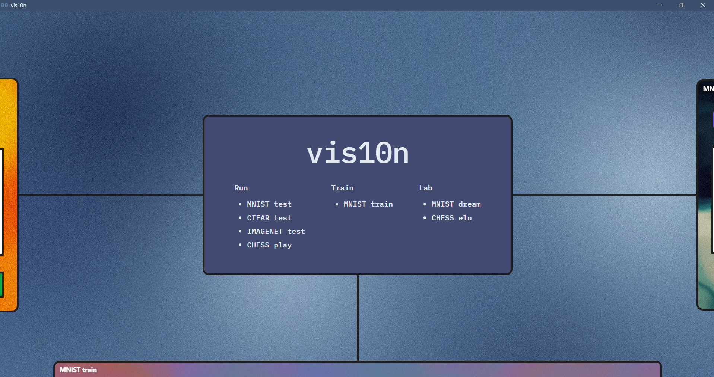
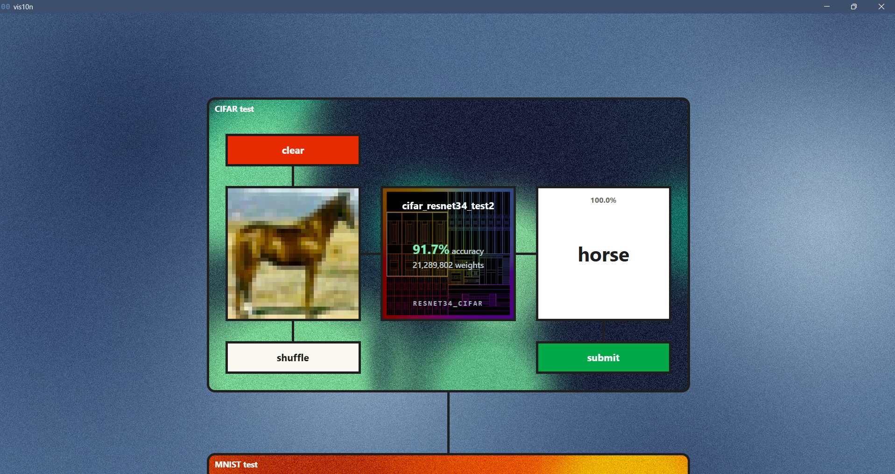
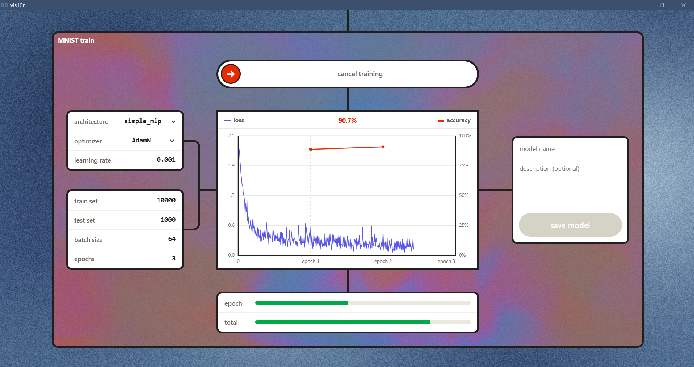
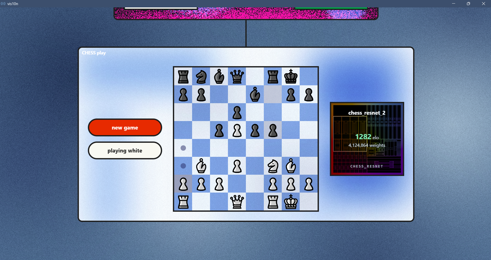

# VIS10N • ML playground
<p>
  
  
</p>
<p>
  
  
</p>
This project is my playground for messing with training and running different types of neural networks, so far including MNIST digit classification, CIFAR image classification, and chess policy models (playing the next move).
Parts of the model code are based off the ARENA (https://arena.education) courses implementation.
The UI for exploring, testing, and training different models is navigated like a gearbox, with different branches corresponding to groups of function (running, training, lab).

## Credits
- Model python code - myself
- UI code (HTML, FastAPI) - Claude Opus 5
- predict.py, image preprocessing - Claude
- UI design - myself, background pixel art - Claude
- Chess pieces - the california set by Jerry S. (CC BY-NC-SA 4.0), via Lichess

## Setup and running
Create and activate a venv:
```
python -m venv .venv
.venv\Scripts\Activate.ps1      # Windows
source .venv/bin/activate       # macOS / Linux
```

Install requirements to venv:
```
pip install -r requirements.txt
```

Runing the app (opens a pywebview window):
```
python main.py
```
On run `start.bat`.

The chess elo window plays against Stockfish, which isn't committed: download it from https://stockfishchess.org/download/ and unzip it into `engines/` (any `stockfish*.exe` under it is found).

## Using the app
**Train model** – choose an architecture, set the training args, then drag the slider to start. Loss (per batch) and accuracy (per epoch) are plotted live, and training can be cancelled by dragging the slider again. When training finishes, press save to give the model a name and description. The MNIST dataset downloads to `data/` on the first run.

**Test model** – open the models window to browse saved models, see each one's stats and training graph, pick one to use or delete it. Then draw a digit on the 28x28 canvas and submit. The model's prediction and its confidence are shown on the right.

**Chess** – load weights trained in `training/train_chess_resnet.ipynb` through the models window, with "Predicts" set to Lichess. *CHESS play*: play against the model (click a piece, then where it goes); it shows the move it picked and how sure it was of it out of its legal moves. Promotions are always to a queen. *CHESS elo*: plays a match against Stockfish held to a set rating and estimates the model's rating from the score, with a 95% range. The range narrows with more games; a model that loses (or wins) every game only shows that it's below (or above) the set rating, so then lower (or raise) it.

**Adding an architecture** – create a file in `models/` (e.g. `models/mlp_256_128.py`) that defines a `Model` class taking no arguments, with a docstring describing it. It appears in the training window's architecture list automatically. Files starting with `_` are for shared code and aren't listed. Once weights have been saved for an architecture, make a new file rather than changing its layers, or those weights won't load.

## How it works
The frontend (`ui/index.html`) talks to a FastAPI server (`ui/server.py`). Training runs in a background thread and streams progress to the page over a websocket. Saved models go in `weights/` as a pair of files: `<name>.pt`, the PyTorch state dict, and `<name>.json`, which records the architecture, training args, parameter counts, per-epoch accuracy and loss, training time, device and git commit. The JSON is what tells the app which architecture to build when loading the weights.

Before predicting, drawings are preprocessed to look like MNIST digits: cropped, scaled to fit a 20x20 box, centred by centre of mass in a 28x28 image and lightly blurred.

## Project structure
- `models/` – model architectures, one file per architecture (`_`-prefixed files hold shared layers)
- `weights/` – saved models and their info files (not committed)
- `dataloaders/` – one module per dataset: `mnist.py` (loading and transforms), `cifar.py` (CIFAR-10 test set)
- `train_model.py` – training args and training loop
- `engines/` – Stockfish (not committed)
- `main.py` – starts the app
- `ui/` – the app: `server.py` (FastAPI server), `launcher.py` (the desktop window), `index.html` (the UI), `predict.py` (loading saved models, preprocessing and prediction), `dream.py` (the dream window's activation maximisation), `chess_engine.py` (chess position/move encoding matching the training data, move picking and Stockfish matches), `assets/` (scripts and images the UI loads, and the README screenshots)