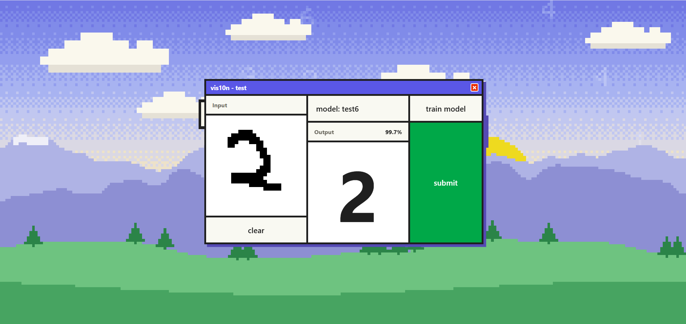
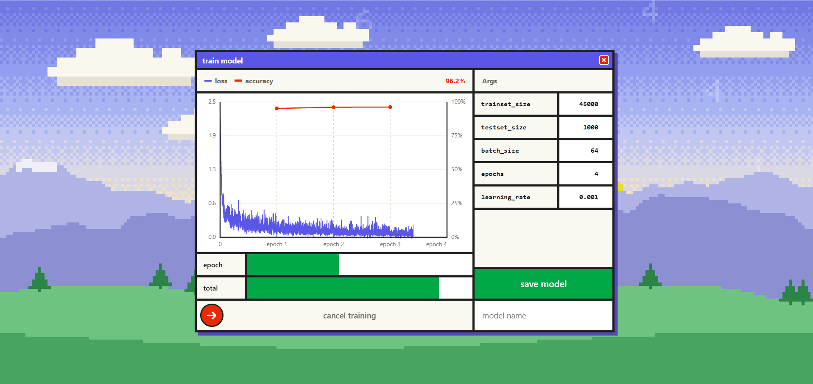

# VIS10N
<p>
  
  
</p>

This project is my basic implementation of training and running hand-drawn digit classification models, trained on the MNIST dataset. Model architectures live in `models/`, so different structures can be trained and compared side by side; the first, `simple_mlp`, has 3 layers (28*28, 100, 10).
The model structure is based off the ARENA (https://arena.education) courses guide.

## Credits
- Model python code - myself
- App code (HTML, FastAPI) - Claude Opus 5
- predict.py, image preprocessing - Claude
- UI design - myself, background pixel art - Claude

## Setup and running
Create and activate a venv:
```
python -m venv .venv
.venv\Scripts\Activate.ps1      # Windows
source .venv/bin/activate       # macOS / Linux
```

Install requirements to venv:
```
pip install -r requirements.txt
```

Run the app; it opens in your browser at http://localhost:8000 once the server is ready:
```
python main.py
```
On Windows you can instead double-click `start.bat`, which runs the app with the venv (no activation needed). Close its window to stop the server.

## Using the app
**Train model** – choose an architecture, set the training args, then drag the slider to start. Loss (per batch) and accuracy (per epoch) are plotted live, and training can be cancelled by dragging the slider again. When training finishes, press save to give the model a name and description. The MNIST dataset downloads to `data/` on the first run.

**Test model** – open the models window to browse saved models, see each one's stats and training graph, pick one to use or delete it. Then draw a digit on the 28x28 canvas and submit. The model's prediction and its confidence are shown on the right.

**Adding an architecture** – create a file in `models/` (e.g. `models/mlp_256_128.py`) that defines a `Model` class taking no arguments, with a docstring describing it. It appears in the training window's architecture list automatically. Files starting with `_` are for shared code and aren't listed. Once weights have been saved for an architecture, make a new file rather than changing its layers, or those weights won't load.

## How it works
The frontend (`window.html`) talks to a FastAPI server (`main.py`). Training runs in a background thread and streams progress to the page over a websocket. Saved models go in `weights/` as a pair of files: `<name>.pt`, the PyTorch state dict, and `<name>.json`, which records the architecture, training args, parameter counts, per-epoch accuracy and loss, training time, device and git commit. The JSON is what tells the app which architecture to build when loading the weights.

Before predicting, drawings are preprocessed to look like MNIST digits: cropped, scaled to fit a 20x20 box, centred by centre of mass in a 28x28 image and lightly blurred.

## Project structure
- `models/` – model architectures, one file per architecture (`_`-prefixed files hold shared layers)
- `weights/` – saved models and their info files (not committed)
- `dataset.py` – MNIST loading and transforms
- `train_model.py` – training args and training loop
- `predict.py` – loading saved models, preprocessing and prediction
- `main.py` – FastAPI server
- `window.html` – the UI